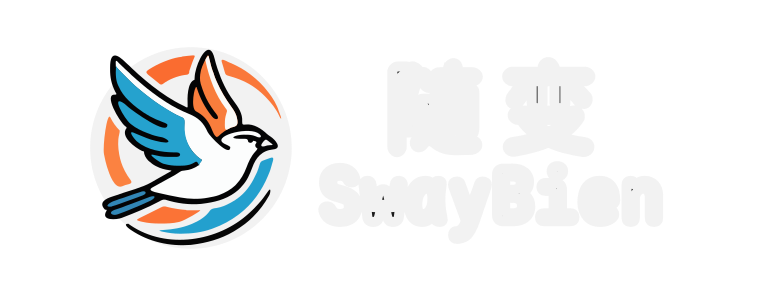

# SwayBien Team's Gogs Theme

> English | [简体中文](README.md)



## Changes and Features

- Replace icons and title with SwayBien icons and title;
- Replace default user avatar with matchstick man avatar;
- Mirror repository sync button;
- Dark mode and toggle button supported by Darkmode.js;
- Page preloading feature supported by instant.page.

## Usage

1. Download the theme files

   ```shellscript
   git clone --depth=1 https://github.com/swaybien/swb-gogs-theme.git || git clone --depth=1 https://git.pj568.eu.org/SwayBien/swb-gogs-theme.git
   ```

2. Link theme files and restart the service

   ```shellscript
   cp -uvr swb-gogs-theme/public path/to/your/gogs/custom/public
   cp -uvr swb-gogs-theme/templates path/to/your/gogs/custom/templates
   # docker compose restart gogs
   ```

3. Update the theme

   ```shellscript
   cd swb-gogs-theme
   git pull
   ```

## Contributing

[Contribution Guidelines](CONTRIBUTING.md)

## License

[Creative Commons Attribution-ShareAlike 4.0 International License](LICENSE)

### Acknowledgments

#### Projects

|     Name     | License                                | Address                                                                                    |
| :----------: | :------------------------------------- | :----------------------------------------------------------------------------------------- |
| darkmode.js  | [MIT license](https://mit-license.org) | [Github](https://github.com/sandoche/Darkmode.js)、[Website](https://darkmodejs.learn.uno) |
| instant.page | [MIT license](https://mit-license.org) | [Github](https://github.com/instantpage/instant.page)、[Website](https://instant.page)     |
